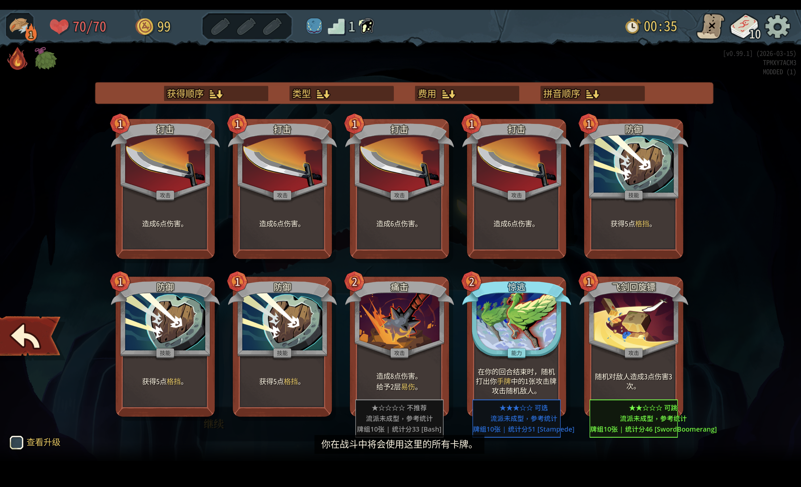
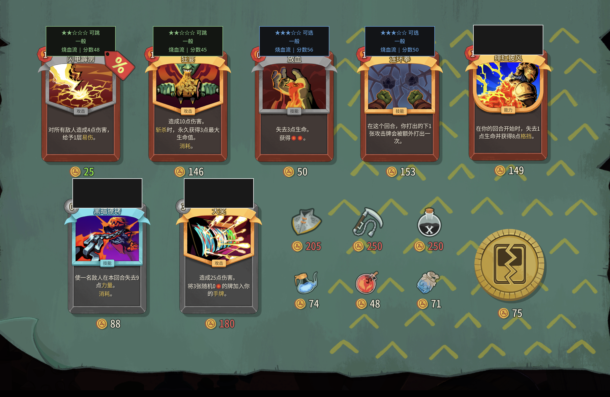

# 杀戮尖塔 2 选牌助手 (STS2 Card Advisor)

基于 [blackpatton17/sts2-draw-rate](https://github.com/blackpatton17/sts2-draw-rate) 开发的增强版选牌推荐 Mod。

自动识别流派、评估卡牌推荐度，在选牌/商店/牌组查看界面实时显示建议。

## 效果预览

| 选牌推荐 | 牌组总览 | 商店推荐 |
|:---:|:---:|:---:|
|  |  |  |

## 主要功能

- **流派识别** — 实时分析牌组，自动识别 15 种流派及成型度
- **选牌推荐** — 综合流派协同、统计数据、牌组需求三维度评分，★1-5 直观展示
- **牌组评估** — 牌组界面显示每张牌的适配度、删除建议、锻造优先级
- **统计数据** — 直接显示胜率/选取率，hover 查看详细分析
- **智能过滤** — 战斗中自动隐藏，诅咒/状态牌不评分

## 安装

### 前置条件

- 《杀戮尖塔 2》Steam 版，切换到 **Public Beta** 分支
- 不需要 BaseLib，游戏原生支持 Mod 加载

### 安装步骤

1. 从 [Releases](../../releases) 下载 `CardProbMod.zip`
2. 在 Steam 库中右键 `Slay the Spire 2` → `管理` → `浏览本地文件`
3. 找到（或创建）`mods` 文件夹，将压缩包解压到其中：
   ```
   mods/
   └── CardProbMod/
       ├── CardProbMod.dll
       ├── CardProbMod.json
       └── result_cleaned.csv
   ```
4. 启动游戏即可

## 反馈与建议

- 提 Issue: [GitHub Issues](../../issues)
- 邮件: wu.hao.cz.21@gmail.com

## 致谢

- [blackpatton17/sts2-draw-rate](https://github.com/blackpatton17/sts2-draw-rate) — 原版胜率显示 Mod
- [ptrlrd/spire-codex](https://github.com/ptrlrd/spire-codex) — STS2 卡牌数据库
- 小黑盒社区 — 胜率/选取率统计数据来源
